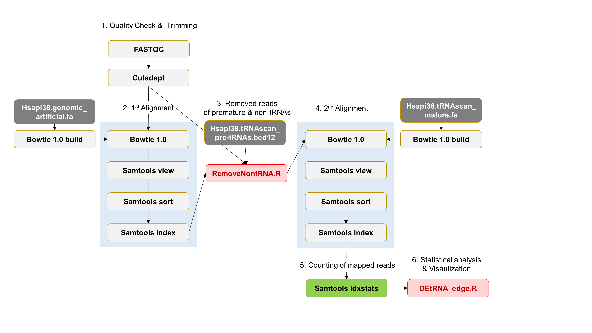

# CLOSHA  

### 새롭게 등록해야할 프로그램  
  * samtools idxstats http://www.htslib.org/doc/samtools-idxstats.html  
  * removeRead.R  
  * stat_edge.R  
  * volcano.R  
  * barplot.R  
  * pyramid.R  

### R 코드 실행시 필요 library  
~~~   
  library(optparse)  
  library(dplyr) 
  library(tidyverse)  
  library(stringr)  
  library(Rsamtools)  
  library(seqinr)  
  library(ShortRead)  
  library(edgeR)  
  library(ggplot2)  
  library(plotrix)   
~~~

### tRNA expression analysis pipeline

  
  
*****************  
### USAGE  
### removeRead.R   
~~~
Usage: removeRead.R [options]

Options:
	--bed=CHARACTER
		bed file of tRNAs [default = Hsapi38.tRNAscan_pre-tRNAs.bed12]

	--bam=CHARACTER
		premapped bam file

	--fastq=CHARACTER
		trimmed fastq file

	-o CHARACTER, --output=CHARACTER
		output file name [default= mature.fastq]

	-h, --help
		Show this help message and exit
~~~   
 
### DEtRNA.R
~~~
Usage: DEtRNA.R [options]

Options:
	--control=CHARACTER
		The directory contained the readcount table of the control group

	--test=CHARACTER
		The directory contained the readcount table of the test group

	--stat=CHARACTER
		The method of statistical analysis.
               This must be one of the stringss (Exact, Quasi-likelihood, likelihood) 

	--adj=CHARACTER
		The adjust method of statistical analysis.
               This must be one of the strings (holm, hochberg, hommel, bonferroni, BH, BY, fdr, none) [default= BH]

	--pvalue=NUMERIC
		p.value threshold for statistical significance

	--foldchange=NUMERIC
		foldchange threshold for statistical significance

	--prefix=CHARACTER
		The output file name [default= sample01]

	-h, --help
		Show this help message and exit

~~~   

	 -o CHARACTER, --output=CHARACTER
		 The output file name [default= output.png]

	 --width=NUMERIC
		 The value of width(px) [default= 800]

	 --height=NUMERIC
		 The value of height(px) [default= 500]

	 -h, --help
		 Show this help message and exit
~~~

